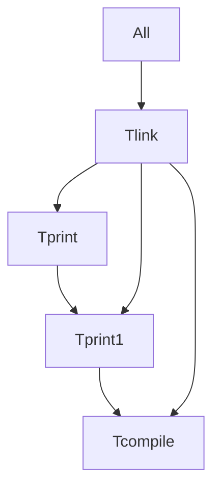

# PyBld

### *TODO*
---
* PyPi classifiers
* Copyright and license issues
* Readme file
* Markdown graph output

* Update template
* single items vs. lists of items (can we make a list of one and have it make sense)
* Environment get/set to pass info between makefiles
* Make sh() run a list of proc's that can be joined later

### *FEATURES*
* Give actual linenumber/filename on errors in make file
* 