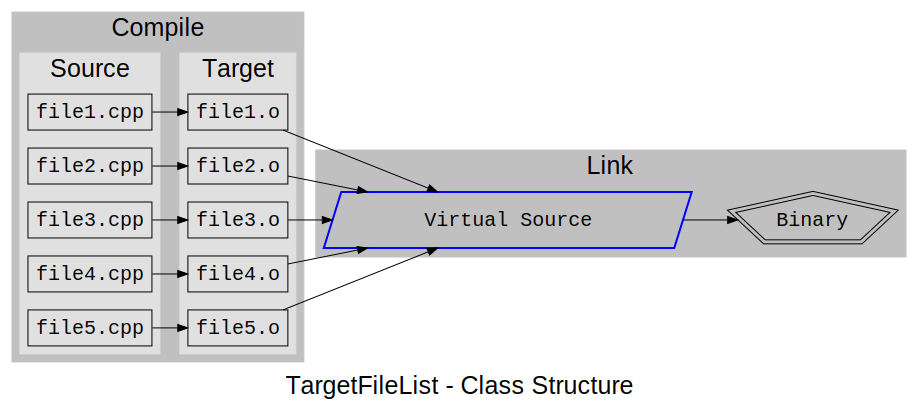

[TOC]
# PyBld - A Python based Makefile System
-----
## Defaults
By default, PyBld will look for the file 'makefile.py'.  If for some reason you have a makefile of a different name, it can be changed with the ```'-f'``` option:

```shell
$> pybld -f better_named_makefile.py
```

Without specifying a target on the command line, it will run the ```'all'``` target and any targets that ```'all'``` depends on. 

```shell
$> pybld        # This builds the 'all' target
```
The default target can be changed by the following code in makefile.py:

```python
config['defaultTargets'] = ['myFavoriteTarget']

    or

config['defaultTargets'] = ['myFavoriteTarget', 'mySecondFavoriteTarget']
```
This value must be in the form of a list.
## Bare Bones Makefile.py
This is the shortest valid makefile:

```python
from PyBld import *

@buildTarget
def all():
    return True
```


## Specifying Dependent Targets




## Pre/Post functions
Setting one or both of these configuration values will allow for a function to be called before any actions are taken by PyBld and after all actions have been taken by PyBld.  This is useful when a global environment must be created, then destroyed while a build is happening.

```python
config['PreMakeFunction'] = lambda : print('====\nBefore any make file stuff is executed\n====')
config['PostMakeFunction'] = lambda : print('====\nAfter all make file stuff is executed\n====')

```

## Built In Helper Functions
### Files

```python
CurrentWorkingDirectory()   # Return the current working directory
CreateDirectory(name)       # Create directory called 'name'
RemoveDirectory(name)       # Delete directory 'name' and subdirectories
RenameFile(old, new)        # Rename file 'old' to 'new'
Touch(name)                 # Touch file 'name', change modified date to now
GetDirectoryFiles(path)     # Return a list of files from 'path'
ChangeDirectory(path)       # Change current directory to 'path'
GetModifyTime(name)         # Get the modified time of file 'name'
```

### Environment
These two functions can get and set environment variables for sub-processes that are launched by PyBld.  This can be used for variables passed to tools like compilers and linkers.

```python
GetEnvVariable(name)           # Get environment variables value
SetEnvVariable(name, value)    # Set environment variable for sub-processes
```
### Debug Setting
Setting the config value 'debug' to 'True' will cause more information to be printed out during the running of PyBld.  This is useful when you need to know how and why PyBld makes some of the decisions it makes with Targets and Dependencies.

```python
config['debug'] = True
```

## Known Issues
* 

## TODO
* Readme file
* Post on github to get project URL
* #include file dependencies
    * Allow files to have multiple dependencies
* Add 'full' command line option to override dependency checking
* Consolidate initialize functions for target list

